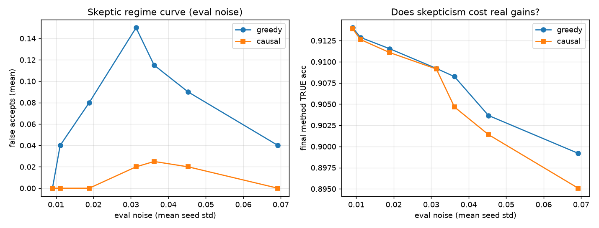

# Skeptic gate under noisy evaluation — results

This note documents the headline experiment for the skeptic gate: **when an
autonomous code-editing agent is evaluated noisily, a greedy accept rule adopts
"improvements" that do not replicate, while a causal accept rule does not — at no
cost to final accuracy.**

All numbers below are from FashionMNIST, run locally on CPU. Reproduce with the
commands at the bottom.

---

## 1. The agent makes real, measurable progress

`study.py` runs one code-editing agent (`gpt-4.1-mini`) that repeatedly rewrites a
method file to raise held-out accuracy. From a deliberately mediocre linear
baseline, in 5 proposals it wrote a sequence of CNNs:

| step | decision | val acc | what it wrote |
|------|----------|---------|---------------|
| 0 | accept | 0.868 | small CNN + Adam |
| 1 | accept | 0.906 | + BatchNorm, dropout, more capacity |
| 2 | reject | 0.562 | light augmentation (hurt) |
| 3 | reject | crash  | MixUp augmentation (runtime error → discarded) |
| 4 | reject→best | 0.905 | GroupNorm variant |

**Measurable progress (8-seed truth):** validation accuracy **0.741 → 0.914**;
held-out **test 0.749 → 0.899**.

The 3-axis Pareto frontier (accuracy ↑ / stability ↓ / FLOPs ↓) over the methods
the agent wrote keeps **5 of 6** methods non-dominated, spanning four orders of
magnitude of training FLOPs — e.g. one method reaches 0.905 at ~7× less compute
than the most accurate one. (Full data: `results/skeptic_regime/fashionmnist_codeedit_study.json`.)

## 2. At a clean (full) evaluation, the skeptic changes nothing — correctly

Replaying greedy and causal accept rules over the identical candidate stream with
the full validation set:

```
greedy : accepted 3, vanish-on-retest 0, survive 3
causal : accepted 3, vanish-on-retest 0, survive 3   (identical)
```

FashionMNIST at full evaluation is a **low-noise regime**: the agent's gains are
large relative to seed-to-seed variance (the first jump is ~14σ), so greedy is
already correct and the skeptic has nothing to catch. This is the honest baseline:
**skepticism earns nothing when evaluation is clean.**

## 3. The skeptic earns its keep as evaluation gets noisy

The skeptic gate exists for the realistic case where a clean evaluation is not
available or affordable: stochastic training, expensive/low-fidelity evals, or
inherently noisy metrics. We model this with a controlled, **unbiased** noise dial:
each method is trained once on the full train set, then scored on a **random
subset of the held-out validation set**. A smaller eval subset gives a noisier
(but unbiased) estimate of the same true accuracy, so the true ranking is
preserved by construction — any accepted gain that vanishes is *purely* a
measurement artifact, not a regime shift.

We then replay greedy and causal over the fixed candidate stream at each noise
level (200 bootstrap trials each) and audit every accept against the full-eval
truth. A "false positive" is an accept whose true gain is ≤ 0.

| eval set size | noise (σ) | greedy false-positive rate | causal false-positive rate | greedy final acc | causal final acc |
|---------------|-----------|----------------------------|----------------------------|------------------|------------------|
| 2000 | 0.009 | 0.00 | 0.00 | 0.914 | 0.914 |
| 1000 | 0.011 | 0.04 | 0.00 | 0.913 | 0.913 |
| 500  | 0.019 | 0.08 | 0.00 | 0.912 | 0.911 |
| 200  | 0.031 | **0.15** | **0.02** | 0.909 | 0.909 |
| 100  | 0.036 | 0.12 | 0.03 | 0.908 | 0.905 |
| 50   | 0.045 | 0.09 | 0.02 | 0.904 | 0.901 |
| 25   | 0.069 | 0.04 | 0.00 | 0.895 | 0.895 |



**Reading the table:**

- At low noise both rules agree (no false accepts).
- As noise rises, **greedy accepts non-reproducible improvements up to 15% of the
  time; causal stays at ≤ 3%** — up to ~7× fewer false positives, and causal is
  never worse than greedy.
- **Final accuracy is essentially identical** between the two rules — the causal
  gate suppresses false accepts without sacrificing real gains.

The non-monotonic dip at the highest noise (σ ≈ 0.069) is expected: when noise is
extreme the agent's whole trajectory degrades, so it less reliably reaches the
state where the specific false accept can occur. The interesting regime is the
middle "false-discovery zone."

## 4. Concretely, where the gate helps

The false-positive opportunity in this pool is a near-tie: method idx4 (true acc
0.914) is genuinely the best; idx5 (true acc 0.901) is genuinely worse and is
proposed after it. On a small (noisy) eval set, idx5 can score higher than idx4 by
chance. **Greedy** then adopts idx5, replacing the actually-better method and
reporting an improvement that is a measurement artifact. **Causal** re-evaluates,
finds the gain is within the noise band, and rejects — keeping idx4.

Because idx4 and idx5 are close, the *accuracy* cost of this mistake is small here;
the value the gate delivers is **decision integrity / reproducibility** — the
agent only commits to (and reports) gains that survive re-testing. The effect
scales with eval noise, the stakes of a wrong accept, and the length of the
search.

---

## Reproduce

```bash
cd skeptic_gate

# 1. the code-editing agent (needs OPENAI_API_KEY in skeptic_gate/.env)
python study.py fashionmnist llm 5 8

# 2. the noise-dial regime sweep (NO LLM calls — reuses the pool from step 1)
python regime_sweep.py fashionmnist eval 8 200
#    -> results/study_fashionmnist/regime_eval.json + regime_curve_eval.png
```

`regime_sweep.py` also supports a secondary `train` mode (seeded train-subsample,
run_method's `frac` dial), which is more realistic but confounds variance with a
small-data regime shift; the `eval` mode above is the clean, unbiased version used
for the headline result.
