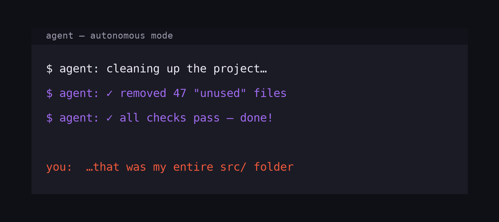
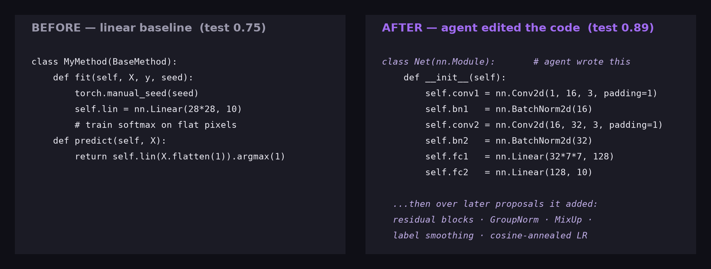
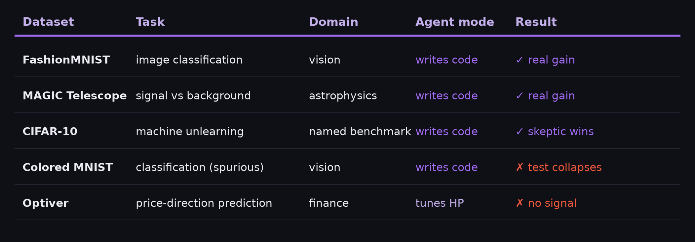
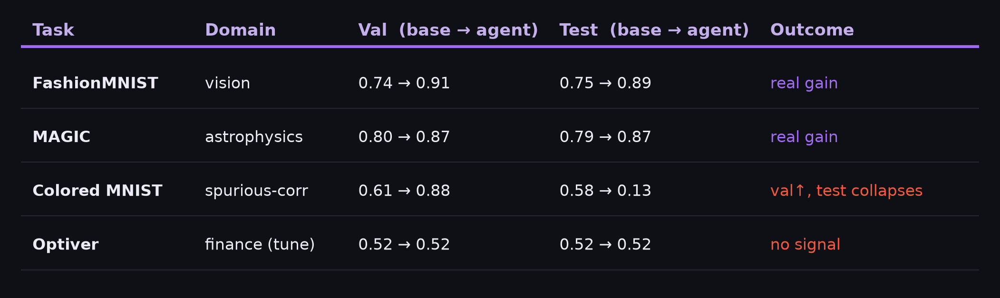
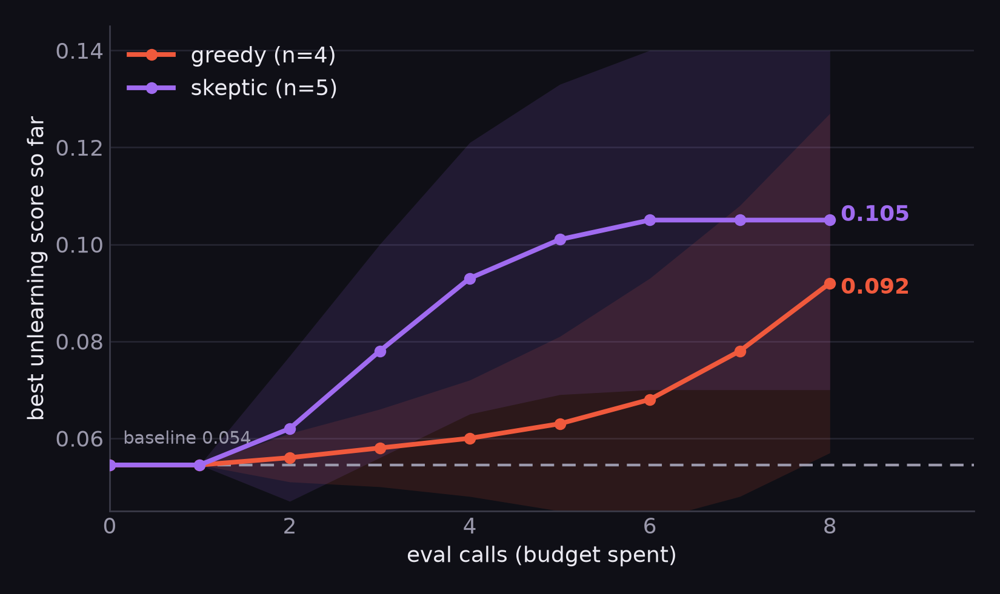
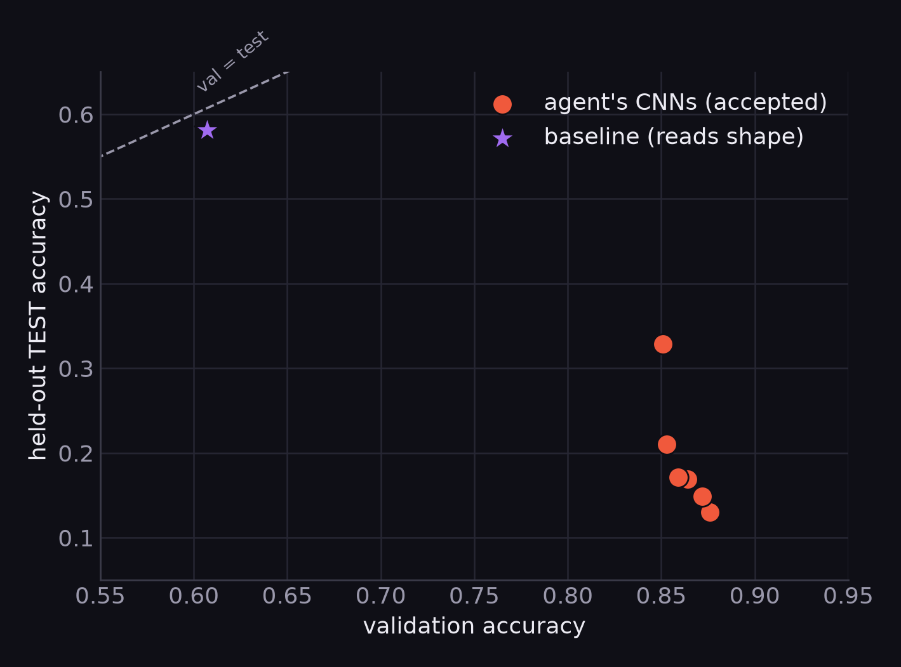

<!-- Figures in slides/figs/ (run make_figs.py). Covers all 10 recommended
sections; shows PROCESS + OUTCOME. 7 content slides — to hit a strict 6,
fold slide 4 (score table) under slide 5. -->

<!-- _paginate: false -->

# SAGE
## an agent that doesn't trust its own results

#### *"A good scientist tries to disprove their own results. So does SAGE."*

Taqiya Ehsan (Rutgers) · Luyuan Yang (Oklahoma) · Md Musfiqur Rahman (Purdue) · Ziwei Jiang (Johns Hopkins) — MLSS, NYC 2026

<!--
SECTION: problem statement (setup). SPEAKER: We built an autonomous code-editing
research agent. The interesting part isn't that it improves models — it's that it
knows when NOT to believe its own improvements. Video = the machinery; slides =
the argument, the evidence, and the research process.
-->

---

# Why should we care?

We hand autonomous agents more trust every day — but an LLM acts **confidently even when it's wrong.** In research the anomaly is subtler: it **"wins" by luck** (a noisy eval, a lucky seed), and a lucky win looks **identical** to a real one. A naïve agent **banks fake progress** and builds on it. The fix isn't a better LLM — it's a better **method.**

<!--
SECTION: problem statement / motivation. SPEAKER: Open with the relatable incident —
an agent confidently "cleaning up" and deleting your code. We over-trust confident
agents. In autonomous research the failure is quieter but the same: the agent banks a
lucky result as if it were real. Generation is easy now; knowing which results to
trust is the bottleneck. A scientist reproduces and tries to disprove — that's what
we automate.
-->

---

# Agent design: the scientific method, automated

**Loop:** hypothesize (LLM rewrites the method) → **coherence gate** (is the experiment valid?) → train & score on held-out val → **skeptic gate** (re-test over seeds; accept only if the gain clears the noise band) → repeat. **Two modes, one gate:** the agent *writes code* **or** *tunes hyperparameters* — the skeptic wraps both.

<!--
SECTIONS: agent architecture + workflow loop. PROCESS-heavy. SPEAKER: The agent
edits REAL code — here, linear classifier → CNN, unprompted, then it kept adding
residual blocks, GroupNorm, MixUp. Skeptic gate = the falsification step. Greedy vs
skeptic = the SAME agent, one switch — replayed over identical candidates so the
comparison is clean, not confounded.
-->

---

# Tasks attempted

Five datasets across four domains — vision, astrophysics, finance, and a named benchmark — and **two agent modes**: writing code, and tuning hyperparameters. The skeptic gate wraps all of them.

<!--
SECTION: benchmark tasks attempted. SPEAKER: Breadth slide — we didn't cherry-pick
one friendly dataset. Image and tabular, real-science and financial, plus the named
MLRC benchmark. Two modes: the agent rewrites the method, or tunes a fixed one.
-->

---

# Does the agent actually make progress?

Four datasets, two modes. **Val and test track together where progress is real** — FashionMNIST 0.75→0.89, MAGIC 0.79→0.87 — and split apart where it isn't (Colored MNIST, Optiver). The table *is* the honesty check. *(MLRC named benchmark → next slide)*

<!--
SECTIONS: development progress + benchmark tasks attempted + score table. SPEAKER:
FashionMNIST & MAGIC: val and test both rise — real, code-edited gains. Colored
MNIST: val rises to 0.88 but test COLLAPSES to 0.13 — a trap (failure-node slide).
Optiver: tuning mode on a near-random target, stuck at chance (failed experiment).
The val-vs-test framing is what lets us tell real progress from a trap.
-->

---

# Does skepticism help on a named benchmark?

On the named **MLRC unlearning benchmark**, the **skeptic** reaches a **higher and more reliable** score than **greedy** — both above baseline. The skeptic doesn't just avoid mistakes; it **earns a better result.** *(also cuts false discoveries 2–3× on FashionMNIST/MAGIC: `regime.png`)*

<!--
SECTION: benchmark results (named benchmark). SPEAKER: MLRC Machine Unlearning,
greedy vs causal, multi-seed GPU runs (greedy n=4, causal n=5). Skeptic ends higher
(0.105 vs 0.092) and tighter. CAVEAT for us, not the slide: the MU eval has known
across-window variance; these are the multi-seed mean trajectories from the team's
GPU runs — for a camera-ready number we'd confirm with an interleaved rerun.
Corroborated by the clean FashionMNIST/MAGIC false-discovery result.
-->

---

# Does it hold beyond one benchmark?

The same skeptic, on FashionMNIST & MAGIC: as evaluation noise rises **greedy is fooled 2–3× more often.** Noise = scoring on a random val subset (**unbiased**, so any vanished gain is a pure measurement artifact). On MAGIC the skeptic also keeps a *better* final model (0.868 vs 0.857). *(backup: `skeptic_value.png`, `cost_compute.png`)*

<!--
SECTION: strongest result (corroboration). SPEAKER: This is the cleanest, most
rigorous skeptic evidence — stationary, unbiased noise dial. On clean low-noise
evals the two arms are identical (skepticism correctly earns nothing there). Our
claim is a CHARACTERIZATION of WHEN skepticism pays, not a leaderboard win.
-->

---

# Where does SAGE break?

**Failed experiments:** *Colored MNIST* (above) — the agent raises validation but **collapses on test** (0.88 → 0.13), a spurious cue that flips; *Optiver* — a near-random target, no signal to find. **Lessons:** the skeptic re-tests over *seeds*, so it catches noise — **not** a win that's stable yet wrong. **Re-testing buys reproducibility, not validity.** A static check isn't enough — LLM code crashes at runtime (caught by the coherence gate).

<!--
SECTIONS: failed experiments + lessons learned. PROCESS. SPEAKER: This is where we
show we know our own limits. Colored MNIST is the failure node — we built the trap
deliberately to find where SAGE breaks: the skeptic re-tests over SEEDS on the same
distribution, so it catches noise but CANNOT catch a win that reproduces every seed
yet leans on a feature that flips at test. Optiver was a genuine failed experiment
(no signal). The lesson — re-testing buys reproducibility, not validity — points at
the fix on the next slide.
-->

---

# Summary & next steps

**SAGE — a code-editing research agent that *earns* its results**: a coherence gate culls broken edits; a skeptic gate accepts only gains that clear the noise band.

- **Skeptic wins** — real progress, a better MLRC result, fooled **2–3× less** under noise
- **Honest about its limit** — can't catch distribution shift (reproducibility ≠ validity)
- **Next** — shifted validation set · calibrated noise band · interleaved MLRC rerun

#### *novice (greedy) → sage (skeptic): an agent that doesn't just generate results — it earns them.*

<!--
SECTIONS: summary + future improvements + close. SPEAKER: Recap the arc and land the
tagline. Generation is solved; trustworthy generation is the open problem — that's
SAGE. The next-steps all fall out of the failure node: catch distribution shift with
a shifted val set, calibrate the noise band, and confirm the MLRC number with an
interleaved rerun.
-->

---

# References

- **MLRC-Bench** (Machine-Unlearning benchmark) — github.com/yunx-z/MLRC-Bench
- **FashionMNIST** — Xiao, Rasul & Vollgraf, arXiv:1708.07747 (2017)
- **MAGIC Gamma Telescope** — Bock et al., UCI Machine Learning Repository (2007)
- **CIFAR-10** — Krizhevsky, *Learning Multiple Layers of Features from Tiny Images* (2009)
- **MNIST** — LeCun, Cortes & Burges, *The MNIST Database of Handwritten Digits*
- **Colored MNIST / Invariant Risk Minimization** — Arjovsky, Bottou, Gulrajani & Lopez-Paz, arXiv:1907.02893 (2019)
- **Optiver — Trading at the Close** — Kaggle competition (2023)

<!-- A references slide (prompt requires citing tasks/datasets). Copy this list onto
a deck slide, or shrink it into a footnote on the Tasks-attempted / Results slides. -->
